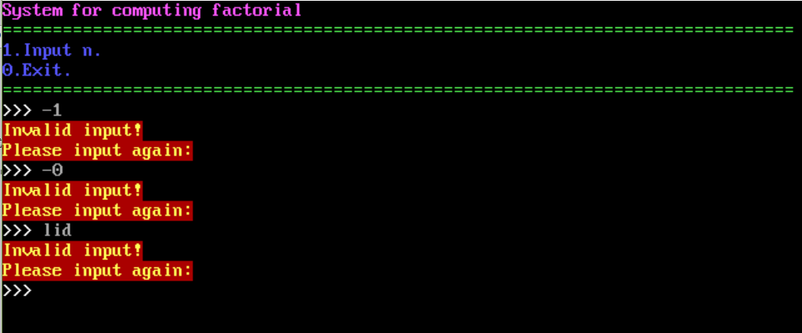
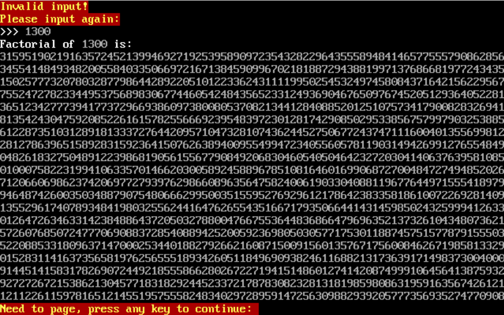
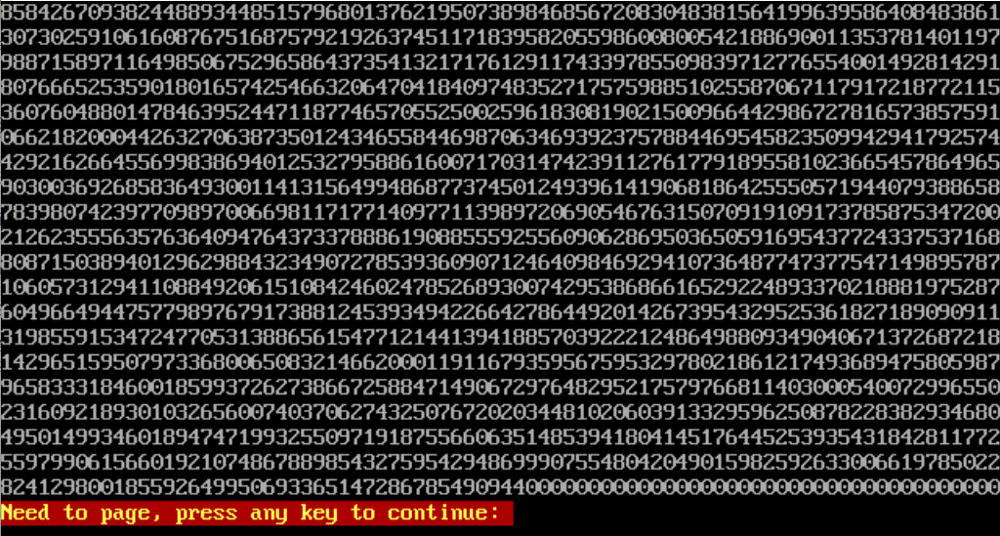
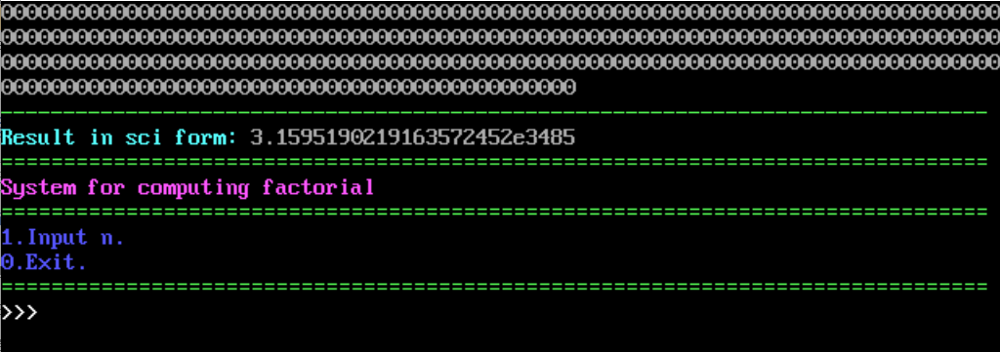

# BigNumMulAssembly

Algorithm for big data multiplication written in pure 8086 assembly.

## Getting Started

These instructions will get you a copy of the project up and running on your local machine for development and testing purposes.

### Prerequisites

What things you need to install the software and how to install them

```
This program is written for 8086 machines, so you need to get dosbox or other simulators to run the code.
It is also necessary for you to get compile and link tools to build the program.
```

### Installing

Clone this repository.

```
git clone https://github.com/GlenGGG/BigNumMulAssembly.git
cd BigNumMulAssembly
```

Open dosbox, mount this project and build.

```
MASM bignummul.ASM
LINK bignummul.obj
```
Then you should be fine.

### Usage

Run the program

```
bignummul.exe
```

### Preview









